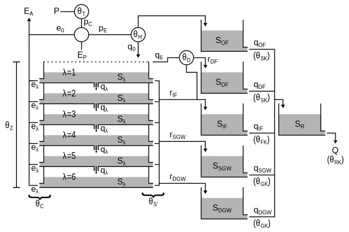

.. currentmodule:: smartpy
.. default-role:: obj

Model Description
=================

History
-------

The Soil Moisture Accounting and Routing for Transport [SMART] model
(`Mockler et al., 2016`_) is a bucket-type rainfall-runoff model.

SMART is an enhancement of the Soil Moisture Accounting and Routing with
Groundwater [SMARG] model, a lumped rainfall–runoff model developed at
National University of Ireland, Galway (`Kachroo, 1992`_), and based on
the soil layers concept (`O'Connell et al., 1970`_; `Nash and Sutcliffe, 1970`_).
Separate soil layers were introduced to capture the decline with soil depth
in the ability of plant roots to extract water for evapotranspiration.
SMARG was originally developed for flow modelling and forecasting and
was incorporated into the Galway Real-Time River Flow Forecasting System
[GFFS] (`Goswami et al., 2005`_).

The SMART model reorganised and extended SMARG to provide a basis for
water quality modelling by separating explicitly the important flow
pathways in a catchment.

.. _`Mockler et al., 2016`: https://doi.org/10.1016/j.cageo.2015.08.015
.. _`Kachroo, 1992`: https://doi.org/10.1016/0022-1694(92)90150-T
.. _`O'Connell et al., 1970`: https://doi.org/10.1016/0022-1694(70)90221-0
.. _`Nash and Sutcliffe, 1970`: https://doi.org/10.1016/0022-1694(70)90255-6
.. _`Goswami et al., 2005`: https://doi.org/10.5194/hess-9-394-2005


Conceptual model
----------------

.. _fig_structure:


   Fig. 1: Conceptual representation of the bucket-type rainfall-runoff model SMART.


Model inputs and outputs
````````````````````````

.. _tab_inputs:
.. table:: Tab. 1: SMART model inputs

   ===============  =====================================  ====================
   Input            Description                            Unit
   ===============  =====================================  ====================
   :math:`P`        Precipitation as rainfall              mm per time step
   :math:`E_P`      Potential evapotranspiration           mm per time step
   ===============  =====================================  ====================


.. _tab_outputs:
.. table:: Tab. 2: SMART model outputs

   ===============  =====================================  ====================
   Output           Description                            Unit
   ===============  =====================================  ====================
   :math:`Q`        River discharge                        m\ :sup:`-3`
                                                           s\ :sup:`-1`
   :math:`E_A`      Actual evapotranspiration              mm per time step
   ===============  =====================================  ====================

Model parameters
````````````````

.. _tab_parameters:
.. table:: Tab. 3: SMART model parameters

   ===================  ====================================  =========  ==============
   Parameter            Description                           Unit       Typical range*
   ===================  ====================================  =========  ==============
   :math:`\theta_T`     Rainfall aerial correction factor     --         0.9--1.1
   :math:`\theta_C`     Evaporation decay coefficient         --         0--1
   :math:`\theta_H`     Quick runoff ratio                    --         0--0.3
   :math:`\theta_D`     Drain flow ratio                      --         0--1
   :math:`\theta_S`     Soil outflow coefficient              --         0--0.013
   :math:`\theta_Z`     Effective soil depth                  mm         15--150
   :math:`\theta_{SK}`  Surface reservoir residence time      timestep   1--240h
   :math:`\theta_{FK}`  Interflow reservoir residence time    timestep   48--1440h
   :math:`\theta_{GK}`  Groundwater reservoir residence time  timestep   1200--4800h
   :math:`\theta_{RK}`  Channel reservoir residence time      timestep   1--96h
   ===================  ====================================  =========  ==============

.. [*] After `Mockler et al. (2016) <https://doi.org/10.1016/j.cageo.2015.08.015>`_.

Model equations
```````````````

The SMART model forcings are precipitation :math:`P` [mm/time step] and
potential evapotranspiration :math:`E_P` [mm/time step]. The precipitation
input is first transformed into the corrected precipitation :math:`p_C`
[mm/time step] using the aerial correction parameter :math:`\theta_{T}` [--]
:eq:`pC`.

.. math::
   :label: pC

   p_C = \theta_{T} P

The difference between corrected precipitation and potential evapotranspiration
determines whether the modelling time step is under energy-limited conditions
(condition :math:`\gamma` is true) or water-limited conditions (:math:`\gamma`
is false) :eq:`condition`. Then, the effective precipitation :math:`p_E`
[mm/time step] :eq:`pE` and the precipitation contribution to the actual
evapotranspiration :math:`e_A` [mm/time step] :eq:`eA` are determined
accordingly.

.. math::
   :label: condition

   \gamma: p_C \geq E_P

.. math::
   :label: pE

   p_E =
   \begin{cases}
       \theta_{T}P - E_P, & \text{if } \gamma \\
       0,                 & \text{otherwise}
   \end{cases}

.. math::
   :label: eA

   e_A =
   \begin{cases}
       E_P,   & \text{if } \gamma \\
       \theta_{T}P, & \text{otherwise}
   \end{cases}

The two parameters for quick runoff ratio :math:`\theta_H` [--] and soil
outflow coefficient :math:`\theta_S` [--] are adjusted according to the
antecedent soil moisture conditions to become :math:`\theta_{H'}` [--]
:eq:`Hprime` and :math:`\theta_{S'}` [--] :eq:`Sprime`, respectively.
The six soil moisture layers are of equal depths and sum up to a total
field capacity defined by the parameter :math:`\theta_Z` [mm].

.. math::
   :label: Hprime

   \theta_{H'} = \theta_H \frac{\sum_{\lambda=1}^{6} S_{\lambda}}{\theta_Z}

.. math::
   :label: Sprime

   \theta_{S'} = \theta_S \frac{\sum_{\lambda=1}^{6} S_{\lambda}}{\theta_Z}

Under energy-limited conditions
'''''''''''''''''''''''''''''''

The infiltration flux :math:`q_0` [mm/time step] and the percolation fluxes
through the soil layers :math:`q_{\lambda}` [mm/time step] are then calculated
as described in Equations :eq:`q0` and :eq:`qlambda`, respectively.

.. math::
   :label: q0

   q_0 = (1 - \theta_{H'}) p_E

.. math::
   :label: qlambda

   q_{\lambda} =
   \begin{cases}
      q_{\lambda - 1} - \Big(\frac{\theta_{Z}}{6} - S_{\lambda}\Big),
         & \text{if } q_{\lambda - 1} + S_{\lambda} > \frac{\theta_{Z}}{6} \\
      0, & \text{otherwise}
   \end{cases}

If all soil layers reach saturation, the saturation excess flux :math:`q_6`
[mm/time step] is divided into quick runoff as drainflow :math:`r_{DF}`
[mm/time step] :eq:`rDF` and slow runoff as interflow. The outflow from
the six soil layers contributes to the three runoff pathways: interflow
:math:`r_{IF}` [mm/time step], shallow groundwater flow :math:`r_{SGW}`
[mm/time step], and deep groundwater flow :math:`r_{DGW}` [mm/time step].
First, the soil outflow contributes to the interflow runoff following a
power law from the top layer to the bottom layer :eq:`rIF`. Then, the
soil outflow contributes to the shallow groundwater runoff following
an inverse law from the top layer to the bottom layer :eq:`rSGW`.
Finally, the soil outflow contributes to the deep groundwater runoff
following a power law from the bottom layer to the top layer :eq:`rDGW`.
The parameter :math:`\theta_{S'}` is used in each of the three law
distributions to determine the fraction of each soil layer that
contributes to runoff during the modelling time step.

.. math::
   :label: rDF

   r_{DF} = \theta_D q_6

.. math::
   :label: sIF

   {s_{IF}}_{\lambda} =
   \begin{cases}
      S_{\lambda}(\theta_{S'})^{\lambda}, & \text{if } \gamma \\
      0,                                  & \text{otherwise}
   \end{cases}

.. math::
   :label: rIF

   r_{IF} =
   \begin{cases}
      \sum_{\lambda=1}^{6} {s_{IF}}_{\lambda}, & \text{if } \gamma \\
      0,                                       & \text{otherwise}
   \end{cases}

.. math::
   :label: sSGW

   {s_{SGW}}_{\lambda} =
   \begin{cases}
      S_{\lambda}\Big(\frac{\theta_{S'}}{\lambda}\Big), & \text{if } \gamma \\
      0,                                                & \text{otherwise}
   \end{cases}

.. math::
   :label: rSGW

   r_{SGW} =
   \begin{cases}
      \sum_{\lambda=1}^{6} {s_{SGW}}_{\lambda}, & \text{if } \gamma \\
      0,                                        & \text{otherwise}
   \end{cases}

.. math::
   :label: sDGW

   {s_{DGW}}_{\lambda} =
   \begin{cases}
      S_{\lambda}(\theta_{S'})^{7 - \lambda}, & \text{if } \gamma \\
      0,                                      & \text{otherwise}
   \end{cases}


.. math::
   :label: rDGW

   r_{DGW} =
   \begin{cases}
      \sum_{\lambda=1}^{6} {s_{DGW}}_{\lambda}, & \text{if } \gamma \\
      0,                                        & \text{otherwise}
   \end{cases}

Under water-limited conditions
''''''''''''''''''''''''''''''

The water deficit :math:`d_0` [mm/time step] :eq:`d0` to meet the potential
evapotranspiration demand is totally or partially provided by the available
soil moisture evapotranspiration fluxes :math:`e_{\lambda}` [mm/time step]
:eq:`elambda`. The variable :math:`b_{\lambda}` [--] :eq:`blambda` acts
as a boolean to stop the soil moisture contribution to evapotranspiration
as soon as the remaining water deficit :math:`d_{\lambda}` [mm/time step]
:eq:`dlambda` has been fully met by a given soil layer; it is initiated
with a value of 1 if a deficit exists :eq:`b0`. The first soil layer can
fully meet the water deficit if it contains enough water, otherwise the
second layer can contribute to meeting the remaining water deficit with a
depleted rate using the evaporation decay parameter :math:`\theta_C` [--]
:eq:`dlambda`, and so forth for the next downward layer down to the bottom
layer. Effectively, a lesser fraction of the available soil moisture in a
layer can meet the remaining water deficit moving downwards following a
power law :eq:`elambda`--:eq:`dlambda`.

.. math::
   :label: d0

   d_0 =
   \begin{cases}
      0,             & \text{if } \gamma \\
      E_P - e_A,     & \text{otherwise}
   \end{cases}

.. math::
   :label: b0

   b_0 =
   \begin{cases}
      0,             & \text{if } \gamma \\
      1,             & \text{otherwise}
   \end{cases}

.. math::
   :label: elambda

   e_{\lambda} =
   \begin{cases}
      b_{\lambda - 1} d_{\lambda - 1},
         & \text{if } S_{\lambda} \geq d_{\lambda - 1} \\
      b_{\lambda - 1} S_{\lambda},
         & \text{otherwise}
   \end{cases}

.. math::
   :label: dlambda

   d_{\lambda} =
   \begin{cases}
      0,
         & \text{if } S_{\lambda} \geq d_{\lambda - 1} \\
      \theta_{C} ( d_{\lambda - 1} - S_{\lambda} ),
         & \text{otherwise}
   \end{cases}

.. math::
   :label: blambda

   b_{\lambda} =
   \begin{cases}
      0,                & \text{if } S_{\lambda} \geq d_{\lambda - 1} \\
      b_{\lambda - 1},  & \text{otherwise}
   \end{cases}


Under water-limited and energy-limited conditions
'''''''''''''''''''''''''''''''''''''''''''''''''

At each time step, whether under water-limited or energy-limited conditions,
the soil layer states :math:`S_{\lambda}` [mm] are updated given their inward
and outward fluxes during the time step as described in :eq:`dSlambda`.


.. math::
   :label: dSlambda

   \frac{dS_{\lambda}}{dt} =
      q_{\lambda - 1} - {s_{IF}}_{\lambda} - {s_{SGW}}_{\lambda}
      - {s_{DGW}}_{\lambda} - e_{\lambda}

The routing for the five runoff pathways is conceptualised as five linear
reservoirs which are characterised by three residence time parameters
:math:`\theta_{SK}` [time step], :math:`\theta_{FK}` [time step], and
:math:`\theta_{GK}` [time step] :eq:`qOF`--:eq:`qDGW`. The five runoff
pathways contribute to a final linear reservoir for channel routing which
is characterised by the residence time parameter :math:`\theta_{RK}`
[time step] to compute the catchment total flow :math:`Q` [mm/time step]
:eq:`Q`.

.. math::
   :label: qOF

   q_{OF} = \frac{S_{OF}}{\theta_{SK}}

.. math::
   :label: qDF

   q_{DF} = \frac{S_{DF}}{\theta_{SK}}

.. math::
   :label: qIF

   q_{IF} = \frac{S_{IF}}{\theta_{FK}}

.. math::
   :label: qSGW

   q_{SGW} = \frac{S_{SGW}}{\theta_{GK}}

.. math::
   :label: qDGW

   q_{DGW} = \frac{S_{DGW}}{\theta_{GK}}

.. math::
   :label: Q

   Q = \frac{S_R}{\theta_{RK}}

Finally, the reservoir states [mm] are updated given their inward and
outward fluxes during the time step as described in Equations
:eq:`dSOF`--:eq:`dSRK`.

.. math::
   :label: dSOF

   \frac{dS_{OF}}{dt}  = \big( p_E - q_0 \big) - q_{OF}

.. math::
   :label: sSDF

   \frac{dS_{DF}}{dt} = r_{DF}  - q_{DF}

.. math::
   :label: dSIF

   \frac{dS_{IF}}{dt}  = \big( q_6 - r_{DF} \big) + r_{IF} - q_{IF}

.. math::
   :label: dSSGW

   \frac{dS_{SGW}}{dt}  = r_{SGW} - q_{SGW}

.. math::
   :label: dSDGW

   \frac{dS_{DGW}}{dt}  = r_{DGW} - q_{DGW}

.. math::
   :label: dSRK

   \frac{dS_{R}}{dt}  = q_{OF} + q_{DF} + q_{IF} + q_{SGW} + q_{DGW} - Q

Procedural model
----------------

The python package `smartpy` is a numerical implementation of the
equations described in the conceptual model presented above. This
procedural model numerically solves these equations using an explicit
forward Euler method, and an operator splitting technique (i.e. the
procedural model solves the equations sequentially following the order
presented above).
